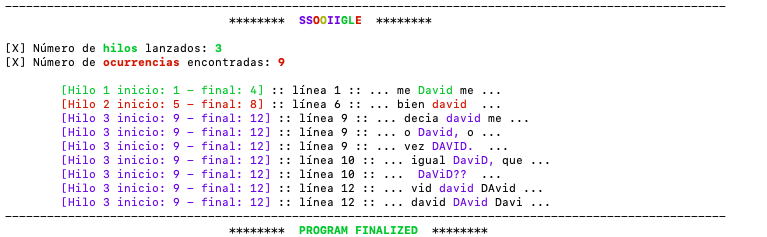

[![uclm](https://img.shields.io/badge/uclm-esi-red.svg?logo=data:image/png;base64,iVBORw0KGgoAAAANSUhEUgAAAA8AAAAPCAYAAAA71pVKAAAC9UlEQVR42o3S3UtTYRwH8F//QhBE3WT0elGr6CZUCLzoRUQt6ibICrESS1MDi7pJwcSXgsCGlG+1LFFzzpzONqduTp3TqVO36V7OzubZ2TznbDvn7NW5nmlXWdADPzg8/D6c3/N9HohSDPCrDgg53bDJByERj0OEpCCEE8cjXlrJaBbOcys2iHpp1OOBgN4MaG/b/BXHfKxgkwuaNvkQE6X8WNDiTI16qP/AicTlMElPeeXTtdTY7G1Kpa/iLU5dnONvhHDyH9hBJGEGu2RV2t93PWaXrb2xAO/kTJgMb5EUM9MGWZQJ5PrnTH9gMwYx2n865PLOrr5uK+XXcLV/YfUD3t5fFFgwN0Y89JzlTUcxb3PNc2YsjVHrdzAKBX1gh+KhsIXokgtJqbopxvIvEa7y600i38xSnXd4qpwa1zcTvcqGqNdHMBPzpzijHSDGcic2WV4Xj0QTGwptBd4meejTGb+gKcS+acMD1mj7Ro3OfcWE3fddnbJnKMRExMuYglbXWUCjjCTQitEBu2dQU05rFp6gsOrJftXzqI9d8gxpajzDk9XUqK6MVs+Xx9igLtnPmewz4GiRnEFprmxtbSXWO4crUCgVrs7hfDTyeLIpiBG29a6fBTxGlPkX116grQBrwnBHq+QCOD9LwflpQIDSNVAjM8IQSVWQfWN1lgZRQRLjH8WF7h5FJW9brww63I2c2WG0N/WkOUVSAHJADZ6BCXAIu/eiP9ehs79Do97xzxrbk5hdsYo9UlVejAnU0lOGFnvT932ubsW2A01WMUxml8Bo2l3QZD7ai+6wnLc5XyGnSuyslTC5UYOOUTJz/enBifR80GaXgjanDGAoJRMGU67Cj/0ZMJZ+DyzVrYdplT4PocXf2B4wWIrwVslJzcUCkB+4AiNHc1HlAMgFN7dr6EgWqC8VgrVeBI7mPkBPUZuUYfeGlehR7HGhbKYzi0F57BqMn7uVrN3Y9rYD0HMEontE4NMuK7yyyVS3WAmujqFd+Bcdh3NlWlsAggAAAABJRU5ErkJggg==&longCache=true&colorA=b30135&colorB=555555&style=for-the-badge)](https://www.esi.uclm.es)

# Manual de usuario
**Autor:** *David Camuñas*  

La compilación y ejecución se realiza de forma automática gracias a la herramienta Makefile.

## Descripción
Práctica perteneciente al laboratorio de la asignatura de *Sistemas Operativos II* (SSOO II) de *ESI - UCLM*.  
Desarrollada en el lenguaje *C++*. Cuyo objetivo es comprender el manejo de hilos (*threads*), como: su creación y su sincronización (con el uso de semáforos).
La finalidad de este proyecto es la simulación de un buscador de palabras en un archivo de texto. Donde N hilos buscarán de forma concurrente, una ocurrencia de la palabra indicada por el usuario.

## Creación de directorios necesarios
Con este comando se crearan los directorios de las clases objeto (*.o), al igual que el directorio que contiene los ejecutables.  
**$ make dirs**  

## Limpieza de directorios
Este comando se ha utilizado para limpiar los directorios en los que se almacenan los ejecutables y las clases objetos (explicada anteriormente su creación).

* *Nota:* Es de muy buena ayuda a la hora de ejecutar la practica en distintos computadores, debido a que como bien es sabido, no se pueden ejecutar un fichero que ha sido compilado en un ordenador, en otro distinto. Esto se debe a que cada ordenador tiene un juego de instrucciones distinto.  
**$ make clean**

## Compilación
El proceso de compilación, se puede realizar de varias formas:  
* **Individual:** 
    * *$ make wordBrowser*
    * *$ make ssooiigle*
* **Conjunta:** *$ make main*

* Otra opción es la de crear los directorios requeridos y compilar los programas a la vez, para ello se utilizara:   
    **$ make all**
    
El formato de compilación utilizado es el siguiente:  
**g++ -I include/ -c -Wall -ansi src/SSOOIIGLE.cpp -o obj/SSOOIIGLE.o -pthread -std=c++11** 

## Ejecución
Para la ejecución del programa se puede realizar al igual que la compilación de varias formas:  
* **Con make:** 
    *   *$ make solution* (Libro de ejemplo en este caso, '*21 LEYES DEL LIDERAZGO*') 
    *   *$ make test* (Archivo de pruebas)
    
Se ejecutará el ejecutable *./exec/SSOOIIGLE*
* **Sin make (manual):** *$ ./exec/SSOOIGLE*  

## Resultado ejecución del programa

